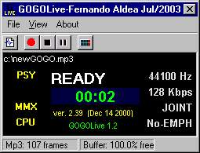



## GOGOLive MP3 Encoder \*UPDATED\*

### Description

GogoLive is the Fastest MP3 Encoder in Real Time. Connect any sound's source to you Sound Card (line in) or play a audio CD and record directly to MP3. Good Quality! Fast Encode! Thank to gogo.dll. Highly recommended for user with low speed PC.
 
### More Info
 

             |
---                |---
**Submitted On**   |2003-07-11 19:25:06
**By**             |[Fernando Aldea](https://github.com/Planet-Source-Code/PSCIndex/blob/master/ByAuthor/fernando-aldea.md)
**Level**          |Intermediate
**User Rating**    |5.0 (10 globes from 2 users)
**Compatibility**  |VB 5\.0
**Category**       |[Sound/MP3](https://github.com/Planet-Source-Code/PSCIndex/blob/master/ByCategory/sound-mp3__1-45.md)
**World**          |[Visual Basic](https://github.com/Planet-Source-Code/PSCIndex/blob/master/ByWorld/visual-basic.md)
**Archive File**   |[GOGOLive\_M1653361032003\.zip](https://github.com/Planet-Source-Code/fernando-aldea-gogolive-mp3-encoder-updated__1-46825/archive/master.zip)

